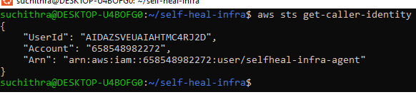
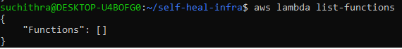

# Coding Agent Connection Proof

The coding agent used in this project was connected to the AWS console via the
AWS CLI, authenticated as a scoped IAM user (`selfheal-infra-agent`) created
specifically for this hackathon.

## Verification 1: Identity check
The agent ran `aws sts get-caller-identity` and confirmed its authenticated
identity.

## Verification 2: Live service call
The agent ran `aws lambda list-functions`, confirming a real, authenticated
call against the AWS Lambda API (returned empty, as no functions were
deployed yet at that point).

